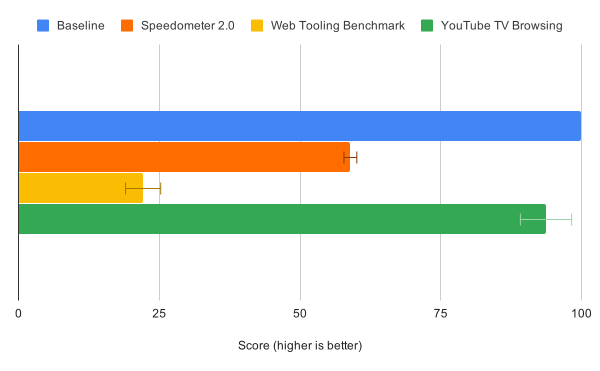
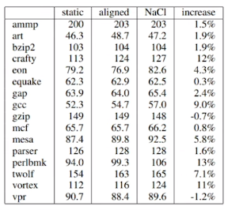
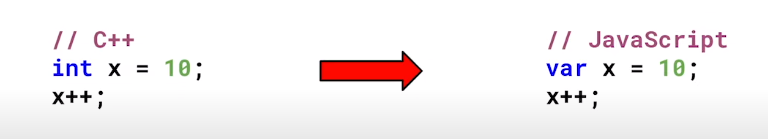
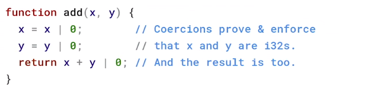
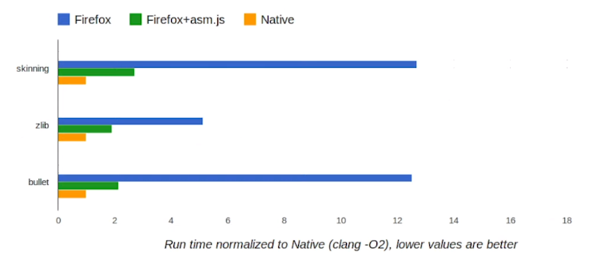

浅谈WebAssembly历史
---

> 感谢Emscripten核心作者Alon Zakai在我写作此篇文章时对邮件所提问题的耐心解答和帮助，如此才使得我能够更全面、详细及正确地还原有关WebAssembly的技术演变历程。

WebAssembly无疑是近年来让人最为兴奋的新技术之一，它虽始于浏览器但已经开始不断地被各个语言及平台所集成。在实际的工业化落地上，区块链、边缘计算、游戏及图像视频等多个领域依靠WebAssembly都创造了让人称赞的产品。WebAssembly技术本身具有非常多的优点，其中最为被人所熟知的三点有：
* 二进制格式
* Low-Level的编译目标
* 接近Native的执行效率

那么WebAssembly是从何演变而来，它为什么具有这些优点与特性并且是如何被标准化的，更重要的是作为普通开发者我们应如何更好的入手开发及实践WebAssembly呢？本专题将会将围绕WebAssembly及Emscripten工具链，通过一系列的文章依次介绍WebAssembly的演变历程、工具链使用、实践案例、最新应用场景及使用技巧，帮助普通开发者正确理解WebAssembly的使用场景，并能够正确且顺利地使用Emscripten工具链完成自己的WebAssembly相关项目。

本文作为专题的第一篇，我们将会较为详细地介绍WebAssembly的相关演变历程，以使得读者能够深入理解WebAssembly这门技术的使用场景，从而更好的学习和使用WebAssembly技术。

### JavaScript的弊端
JavaScript毫无疑问是技术领域的佼佼者。自Brendan Eich于1995年花费10天时间为Netscape开发出JavaScript为始，到现在已经走过了20多个年头。随着技术的蓬勃发展，不管是NPM与GitHub上丰富的JavaScript库与框架，还是React Native、Node.js、Electron、QuickJS等领域技术的出现，无一不彰显着JavaScript生态的繁荣，JavaScript这门语言也变得越来越流行和重要。

但与此同时，随着各类应用功能的复杂化，受限于JavaScript语言本身动态类型和解释执行的设计，其性能问题也逐渐凸现。我们厄待需要新的技术帮助我们解决JavaScript的性能问题。在2008年底，Google、Apple、Mozilla为JavaScript引入了JIT（Just-In-Time）引擎，试图解决JavaScript的性能问题，并取得了非常好的效果。其中的佼佼者非Google的V8莫属，其大举提升了JavaScript的性能，并拉开了JavaScript引擎竞速的序幕。

那JIT（Just-In-Time）引擎是如何提升JavaScript的性能的呢？我们知道，由于JavaScript是解释型语言，因此JavaScript引擎需要逐行对JavaScript代码进行翻译变为可执行的代码。可执行代码有多种形式，其中较为常见的是基于AST的直接执行以及ByteCode的执行方式。显而易见，这些做法相比于直接运行机器码而言都并不高效，那么如果我们能根据代码的执行频次将部分代码实时编译为机器码，则会获得更大的性能提升，这就是JIT（Just-In-Time）的基本思路。

在实际生产中，JIT（Just-In-Time）引擎一般会引入多层次的决策来优化我们的代码：
* warm阶段（解释执行的代码被执行多次）： 将解释执行的代码发送给JIT（Just-In-Time）引擎，并创建出编译为机器码的执行代码，但此处并不进行替换；
* hot阶段（解释执行的代码被执行得十分频繁）： 解释执行代码被替换为warm阶段的机器码执行代码；
* very hot阶段：将解释执行的代码发送给优化编译器（Optimising Compiler），创建和编译出更高效的机器码的执行代码并进行替换；

假设我们的JavaScript代码中有部分代码被执行了多次，此时这部分代码会被标记为warm，同时被送往JIT（Just-In-Time）引擎进行优化。JIT（Just-In-Time）引擎此时会针对这些代码进行逐行的机器码编译，然后存储在一张表的单元中（实际上表单元仅指向了被编译的机器码）。当解释执行的代码被执行得非常频繁时变会进入hot阶段，JIT（Just-In-Time）引擎会将解释执行的代码直接替换为编译的机器码版本。

需要注意的是，表单元的引用依据实际上会依赖于行号以及参数类型，假设我们有如下的代码：
```javascript
function doSomething(value){
    // performing some operations
}

const arr = [0, "String"];
for (let i = 0; i < arr.length; i++) {
    doSomething(arr[i])
}
```
由于数组arr中存在两种数据类型（Number/String），当我们多次执行相关代码时，`doSomething`函数会被JIT（Just-In-Time）引擎创建并编译出两个不同类型的机器码执行代码版本，并且使用不同的表单元进行引用。当然，由于机器码执行代码的创建和编译是存在代价的，因此不同的JIT（Just-In-Time）引擎会有不同的优化策略。

如果部分代码执行得异乎频繁，那么自然的这部分解释执行的代码会被发送给优化编译器（Optimising Compiler）进行更高程度的优化，从而创建并编译出相比warm阶段更高效的机器码执行代码版本。与此同时，在创建这些高度优化的机器码执行代码期间，编译器将会严格限制执行代码的适用类型（比如仅适用于Number/String或某些特定类型参数），并且在每次调用执行前都会进行参数类型的检查，如果匹配则会使用这些高度优化的机器码执行代码，否则将会回退到warm阶段生成的机器码执行代码或是直接解释执行。

当JavaScript有了JIT（Just-In-Time）后就能高枕无忧了么？不尽然。从上面的介绍中我们可以看到，JIT（Just-In-Time）引擎的优化并非是完全无代价的。同时由于JavaScript自身的灵活性，如果我们编写JavaScript代码时并没有将数据类型严格固定，那么JIT（Just-In-Time）的效果将会被大打折扣。在Google V8团队的[《JIT-less V8》](https://v8.dev/blog/jitless)文章中我们可以看到，使用JIT-less模式的V8在运行Youtube的Living Room页面时，其测试成绩与使用JIT的V8实际差距仅为6%。这个测试侧面反应了JIT在生产中并不是完全的“性能银弹”。

<div align="center">
	
	<p style="font-size:12px;">JIT-less模式下V8与基线的对比</p>
</div>

那么JavaScript能变得更快么，还是说我们需要其他技术来解决JavaScript的性能问题？此时NaCl和PNaCl应运而生。

### NaCl与PNaCl

尽管JavaScript由于JIT的加入在性能上有了很大的提升，但在许多性能敏感的领域，JavaScript仍旧无法满足我们的需求，因此在2008年，Google的Brad Chen、Bennet Yee以及David Sehr开源了NaCl技术，并在2009年正式达到生产可用的状态。NaCl全称为"Native Client"，其由C/C++语言编写并定义了一套Native Code的安全子集（SFI技术)，并执行于自己独立的沙盒环境之中，以防止安全性未知的C/C++代码对操作系统本身产生危害。

NaCl应用及其模块在性能上与原生应用的差距非常小，但由于NaCl与CPU架构强关联不具有可移植性，因此需要针对不同的平台进行开发以及编译，这导致了我们无法自由分发NaCl应用及其模块。为了解决这个问题，NaCl改进技术PNaCl出现了。

<div align="center">
	
	<p style="font-size:12px;">NaCl的性能损耗极小</p>
</div>

PNaCl的全称为"Portable Native Client"，其通过替换Native Code为LLVM IR子集并在客户端编译为NaCl的方式解决了NaCl的分发问题。PNaCl不依赖于特定的CPU架构，更易于被部署和使用，“一次编译，到处运行”在PNaCl上得到了实现。但同样的，PNaCl也是运行在自己的独立沙盒之中，其无法直接的访问Web APIs，而是需要通过一个名为"PPAPI"的接口来与JavaScript进行通信。

PNaCl技术在当时看起来是一个非常理想的方案，其兼具高性能和易于分发的特点，但实际上其在当时并没有受到非常强的支持。PPAPI出现的时代正好是处于人们尽可能试图摆脱Flash、Java Applet等插件的时代，尽管当时Chrome已经将NaCl与PNaCl直接集成，但其运行在独立沙盒环境与使用独立API的方式与Flash、Java Applet等插件非常类似。同时，其开发难度和成本以及糟糕的兼容性问题（2011年开始Firefox及Opera正式支持PPAPI及NaCl）都成为了NaCl/PNaCl普及的最大障碍。

### 让人惊艳的asm.js

谈到asm.js和WebAssembly就不得不提到其中关键人物Alon Zakai。在2010年，Alon Zakai结束了两年的创业项目，加入了Mozilla负责Android版Firefox的开发。在Mozilla的工作之余，Alon Zakai继续编写着自己的C/C++游戏引擎，在项目临近尾声之时，Alon Zakai突发奇想，想将自己的C/C++游戏引擎运行在浏览器上。在2010年，NaCl还是一门非常新的技术，而PNaCl才刚刚开始开发，此时并没有一个非常好的技术方案能够将Alon的C/C++游戏引擎跑在浏览器上。但好在C/C++是强类型语言，而JavaScript是弱类型语言，将C/C++代码编译为JavaScript代码在技术实现上是完全可行的。于是Alon Zakai自此开始编写相关的Compiler实现，`Emscripten（LLVM into JavaScript）`由此诞生了！

<div align="center">
	
</div>

到2011年，Emscripten已经具备编译像Python以及DOOM等中大型项目的能力，与此同时Emscripten也在JSConfEU会议上首次亮相，并取得了一定的影响力。Mozilla看到了Emscripten项目的巨大潜力（相较于NaCl而言更加的Web友好），Brendan及Andreas邀请Alon加入Mozilla的Research团队全职负责Emscripten项目的开发，Alon Zakai欣然接受并将工作的重心放在了如何提升Emscripten编译的JavaScript代码执行速度上。

在`JavaScript的弊端`章节中我们可以看到，尽管JavaScript拥有JIT（Just-In-Time），但由于JavaScript本身的语言特性，导致JIT（Just-In-Time）难以被预测，在实际的生产环境当中JIT（Just-In-Time）的效果往往并没有那么显著。为了使得JavaScript运行得更快，我们应该要更充分的利用JIT（Just-In-Time），因此在2013年，Alon Zakai联合Luke Wagner，David Herman发布了asm.js。

asm.js的思想很简单，就是尽可能的明确对应的类型，以便JIT（Just-In-Time）能够被充分利用。如下图示例所示：

<div align="center">
	
</div>

我们可以看到，对于`add`函数而言，由于传入参数`x`，`y`以及返回值进行了`|0`的操作，那么其能够很明确为JIT（Just-In-Time）指明对应的类型（i32），因此能被JIT（Just-In-Time）充分优化（不考虑后期AOT的情况）。通过添加类似的类型注解，Emscripten编译的asm.js在运行速度上相比普通JavaScript有了质的飞跃，在Benchmark中，asm.js能达到Native性能的50%左右，相比于普通的JavaScript代码而言取得了极大的性能提升，这无疑是让人兴奋的成果，但是asm.js自身也存在一些无法忽视的问题，其总体而言并不是一个非常理想的技术方案。

<div align="center">
	
</div>

最显而易见的就是asm.js代码的"慢启动"问题，由于asm.js还是和JavaScript一样的文本格式，因此对于大中型项目而言，其解析所花费的时间会非常长，无法与高效的二进制格式相提并论。其次，asm.js实质上是一种较为hack的实现方式，类似`|0`的类型标注不具有可读性，同时拓展asm.js也变得越来越复杂且不可靠：随着asm.js想要更加接近于Native的执行性能，不免会对诸多Math函数（例如Math.imul及Math.fround等）进行拓展和改写，从长远来看这对TC39标准的制定是不友好的，同时asm.js自身的相关实现（例如memory growth等）也遭遇了非常多的问题而被迫不断修订asm.js标准。"The hacks had a cost"，因此我们需要一个全新的技术来解决asm.js所遇到的这些问题。

### 合作共赢 - WebAssembly

在2013年，NaCl/PNaCl与asm.js/Emscripten形成了不同路线发展的竞争态势，但与此同时，Google及Mozilla也在工具及虚拟机层面加强了许多合作，其中包括：
* 由Google的JF Bastien牵头的每月Google和Mozilla工具团队之间的交流会；
* Emscripten和PNaCl开始互相共享部分代码，包括Legalization Passes、le32 triple等；
* 尝试将NaCl应用通过Emscripten进行编译，并开源Pepper.js；
* Google及Mozilla共同就asm.js进行代码贡献并规划未来Native Code在Web上的合理方案；
* 就WebAssembly前身"WebAsm"进行标准和方案的讨论；

最终在2015年的4月1号，"WebAssembly"击败了"WebAsm"、"WebMachine"以及其它名称在Google和Mozilla的团队交流邮件中被确定使用。至2015年6月17号，两方就WebAssembly的标准化工作进行了确定，并搭建了WebAssembly官网同时进行了对外的宣传工作。WebAssembly的设计汲取了NaCl与asm.js两者的优点：
* WebAssembly并不依赖于JavaScript，与NaCl/PNaCl一样，它基于二进制格式，能够被快速的解析；
* 与asm.js一样，依靠Emscripten等工具链提供的API，它以非常自然的方式直接操作Web APIs，而不用像PNaCl一样需要处理与JavaScript之间的通信；
* WebAssembly依赖于LLVM IR并使用独立的VM环境，因此其它语言/平台能够以较低成本进行接入，并且能够且易于被持续优化至接近Native的性能；

目前各大主流浏览器已经完全实现了WebAssembly的MVP版本，并已被接纳为"浏览器的第二语言"。依靠优秀的设计，WebAssembly也从浏览器平台走向更多的平台，WASI（WebAssembly System Interface）将为WebAssembly提供更多的可能性。随着WebAssembly的相关标准的逐渐确定和完善，WebAssembly技术的应用领域将会越来越广。

### 最后
本文我们从JavaScript开始，介绍了NaCl/PNaCl以及asm.js技术方案的优缺点。通过简单回顾WebAssembly的相关历史背景，我们能更好地够理解WebAssembly技术的演变过程及其适用场景。在后面的文章中，我们将基于Emscripten工具链继续探讨WebAssembly，通过具体的实例介绍WebAssembly应用的基本方法和相关实现。
