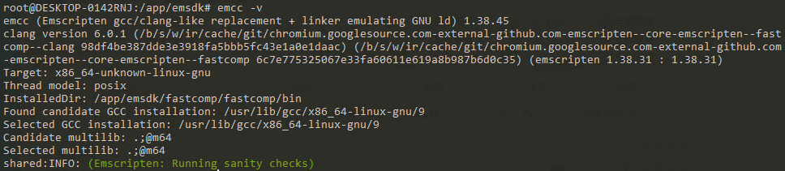
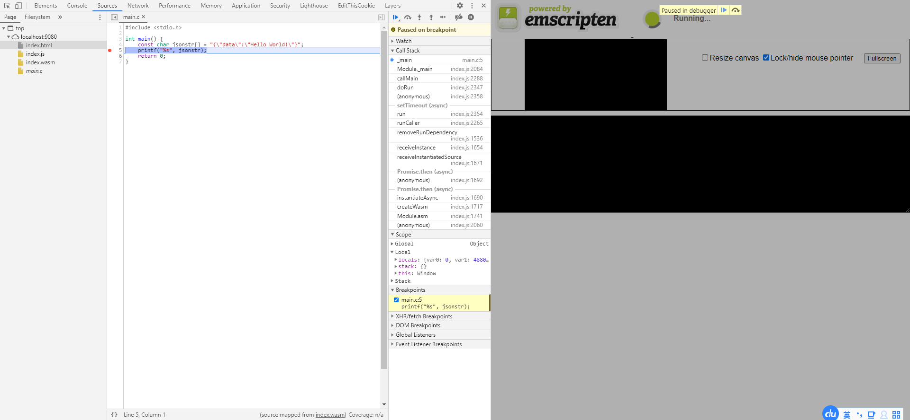

Emscripten使用入门
----

在上一篇中我们较为详细的讲述了WebAssembly的演变历程，通过WebAssembly的演变历程我们对WebAssembly的三个优点（二进制格式、Low-Level的编译目标、接近Native的执行效率）也有了比较深刻的理解。在本章中我们将选取Emscripten及C/C++语言来简要讲述WebAssembly相关工具链的使用，通过较为简单的例子帮助大家能够更为快速上手WebAssembly相关的应用开发。请放心，在本章中我们将避免复杂难懂的C/C++语言技巧，力求相关示例简单、直接、易懂。如果你有Rust、Golang等支持WebAssembly的相关语言背景，那么可以将本章相关内容作为参考，与对应官方工具链进行结合学习。

### 关于Emscripten

Emscripten是WebAssembly工具链里重要的组成部分。从最为简单的理解来说，Emscripten能够帮助我们将C/C++代码编译为ASM.js以及WebAssembly代码，同时帮助我们生成部分所需的JavaScript胶水代码。但实质上Emscripten与LLVM工具链相当接近，其包含了各种我们开发所需的C/C++头文件、宏参数以及相关命令行工具。通过这些C/C++头文件及宏参数，其可以指示Emscripten为源代码提供合适的编译流程并完成数据转换，如下图所示：

<div align="center">
	
	<p style="font-size:12px;">Emscripten编译流程（来自官网）</p>
</div>

emcc是整个工具链的编译器入口，其能够将C/C++代码转换为所需要的LLVM-IR代码，Clang/LLVM（Fastcomp）能够将通过emcc生成的LLVM-IR代码转换为ASM.js及WebAssembly代码，而emsdk及.emscripten文件主要是用来帮助我们管理工具链内部的不同版本的子集工具及依赖关系以及相关的用户编译设置。

在我们的日常业务开发过程中，实际上并不需要太过关心Emscripten内部的实现细节，Emscripten已经非常成熟且易于使用。但相关读者若想知道Emscripten内部的更多细节，可以访问Emscripten官网以及Github阅读相关WIKI进行了解。

### 下载、安装与配置

在进行相关操作之前，请先确保已经安装git工具并能够使用基本的git命令，接下来我们以Linux系统下的操作作为示例演示如何下载、安装及配置Emscripten。若你的操作系统为Windows或是OSX等其他系统，请参考官方文档中的相关章节进行操作。

* 安装

进入你自己的安装目录，执行如下命令获取到Emscripten SDK Manager（emsdk）：
```shell
> git clone https://github.com/emscripten-core/emsdk.git
```

* 下载
进入emsdk目录，并执行如下的命令进行安装操作：
```shell
> cd emsdk
> git pull
> ./emsdk install latest
```
需要注意的是，install命令可以安装特定版本的Emscripten开发包及其依赖的所有自己工具，例如：
```shell
> ./emsdk install 1.38.45
```

* 激活及配置
当安装完成后，我们可以通过如下命令进行Emscripten的激活和配置：
```shell
> ./emsdk activate latest # or ./emsdk activate 1.38.45
> source ./emsdk_env.sh
```

现在让我们执行 `emcc -v` 命令查看相关的信息，若正确输出如下类似信息则说明Emscripten安装及配置成功。

<div align="center">
	
	<p style="font-size:12px;">emcc -v的相关信息输出</p>
</div>

### 小试身手
终于进入有趣的部分了，按照惯例，我们先以打印"Hello World!"作为我们学习WebAssembly的第一个程序吧！让我们先快速编写一个C/C++的打印"Hello World!"代码，如下所示：
```C++
#include <stdio.h>

int main() {
  printf("Hello World!\n");
  return 0;
}
```

这个程序很简单，使用相关的GCC等相关编译器能够很正确得到对应的输出。那么如何产出WebAssembly的程序呢？依靠Emscripten整个操作也非常简单：
```shell
> emcc main.c -o hello.html
```
执行完毕后你将得到三个文件代码，分别是：
* hello.html
* hello.js：相关的胶水代码，包括加载WASM文件并执行调用等相关逻辑
* hello.wasm：编译得到的核心WebAssembly执行文件

接着我们在当前目录启动一个静态服务器程序（例如NPM中的static-server），然后访问hello.html后我们就能看到"Hello World!"在页面上正确输出了！当然，实际上hello.html文件并不是一定需要的，如果我们想要让NodeJS使用我们代码，那么直接执行：
```shell
> emcc main.c
```
即可得到 `a.out.js` 及 `a.out.wasm` 两个文件，然后我们使用NodeJS执行：
```shell
> node a.out.js
```
也能正确的得到对应的输出（你可以自行创建html文件并引入 `a.out.js`进行浏览器环境的执行 ）。

当然，在我们的日常的业务开发中相关程序是不可能如此简单的。除了我们自己的操作逻辑外，我们还会依赖于非常多商用或开源的第三方库及框架。比如在数据通信及交换中我们往往会使用到JSON这种轻量的数据格式。在C/C++中有非常多相关的开源库能解决JSON解析的问题，例如`cJSON`等，那么接下来我们就增加一点点复杂度，结合 `cJSON` 库编一个简单的JSON解析的程序。

首先我们从Github中找到 `cJSON` 的主页，然后下载相关的源码放置在我们项目的vendor文件夹中。接着我们在当前项目的根目录下创建一个`CMakeList.txt`文件，并填入如下内容：

```CMake
cmake_minimum_required(VERSION 3.15) # 根据你的需求进行修改
project(sample C)

set(CMAKE_C_STANDARD 11) # 根据你的C编译器支持情况进行修改
set(CMAKE_EXECUTABLE_SUFFIX ".html") # 编译生成.html

include_directories(vendor) # 使得我们能引用第三方库的头文件
add_subdirectory(vendor/cJSON)

add_executable(sample main.c)

# 设置Emscripten的编译链接参数，我们等等会讲到一些常用参数
set_target_properties(sample PROPERTIES LINK_FLAGS "-s EXIT_RUNTIME=1")
target_link_libraries(sample cjson) # 将第三方库与主程序进行链接
```

那什么是 `CMakeList.txt` 呢？简单来说，`CMakeList.txt` 是 `CMake` 的“配置文件”，`CMake` 会根据 `CMakeList.txt` 的内容帮助我们生成跨平台的编译命令。在我们现在及之后的文章中，不会涉及非常复杂的 `CMake` 的使用，你完全可以把 `CMakeList.txt` 里的相关内容当成固定配置提供给多个项目的复用，如若需要更深入的了解 `CMake` 的使用，可以参考 `CMake` 的官网教程及文档。好了，现在让我们在代码中引入 `cJSON` 然后并使用它进行JSON的解析操作，代码如下：

```C++
#include <stdio.h>
#include "cJSON/cJSON.h"

int main() {
    const char jsonstr[] = "{\"data\":\"Hello World!\"}";
    cJSON *json = cJSON_Parse(jsonstr);

    const cJSON *data = cJSON_GetObjectItem(json, "data");
    printf("%s\n", cJSON_GetStringValue(data));

    cJSON_Delete(json);
    return 0;
}
```

代码的整体逻辑非常简单易懂，在这里就不再赘述。由于我们使用了 `CMake`，因此Emscripten的编译命令需要有一点点修改，我们将不使用emcc而是使用emcmake及emmake来创建我们的相关WebAssembly代码，命令如下：
```shell
> mkdir build
> cd build
> emcmake cmake ..
> emmake make
```

我们创建了一个build文件夹用来存放cmake相关的生成文件及信息，接着进入build文件夹并使用emcmake及emmake命令生成对应的WebAssembly代码sample.html、sample.js、sample.wasm，最后我们执行访问sample.html后可以看到其正确的输出了JSON的data内容。

> 如若你从未使用过CMake，请不要为CMake的相关内容因不理解而产生沮丧或者畏难情绪。在我的日常的WebAssembly开发中，基本都是沿用一套 `CMakeList.txt` 并进行增删改，与此同时编译流程基本与上诉内容一致，你完全可以将这些内容复制在你的备忘录里，下次需要用到时直接修改即可。

### WebAssembly的调试

对于开发的WebAssembly代码而言，我们对于调试可以使用两种方式，一种方式是通过日志的方式进行输出，另一种方式使用单步调试。使用日志的方式输出调试信息非常容易，Emscripten能很好的支持C/C++里面的相关IO库。而对于单步调试而言，目前最新版本的Firefox及Chrome浏览器都已经有了一定的支持，例如我们有如下代码：

```C++
#include <stdio.h>

int main() {
    printf("Hello World!");
    return 0;
}
```

然后我们使用emcc进行编译得到相关的文件：
```shell
> emcc -g4 main.c -o main.wasm # -g4可生成对应的sourcemap信息
```
接着打开Chrome及其开发者工具，我们就可以看到对应的main.c文件并进行单步调试了。

<div align="center">
	
	<p style="font-size:12px;">使用Chrome进行单步调试</p>
</div>

但值得注意的是，目前emcmake对于soucemap的生成支持并不是很好，并且浏览器的单步调试支持也仅仅支持了代码层面的映射关系，对于比较复杂的应用来说目前的单步调试能力还比较不可用，因此建议开发时还是以日志调试为主要手段。

### JavaScript调用WebAssembly

对于WebAssembly项目而言，我们经常会需要接收外部JavaScript传递的相关数据，难免就会涉及到互操作的问题。回到最开始的JSON解析例子，我们一般情况而言是需要从外部JavaScript中获取到JSON字符串，然后在WebAssembly代码中进行解析后做对应的业务逻辑处理，并返回对应的结果给外部JavaScript。接下来，我们会增强JSON解析的相关代码，实现如下：
```C++
#include <stdio.h>
#include "cJSON/cJSON.h"

int json_parse(const char *jsonstr) {
    cJSON *json = cJSON_Parse(jsonstr);
    const cJSON *data = cJSON_GetObjectItem(json, "data");
    printf("%s\n", cJSON_GetStringValue(data));
    cJSON_Delete(json);
    return 0;
}
```

在如上代码中，我们将相关逻辑封装在 `json_parse` 的函数之中，以便外部JavaScript能够顺利的调用得到此方法，接着我们修改一下 `CMakeList.txt` 的编译链接参数：
```CMake
#....
set_target_properties(sample PROPERTIES LINK_FLAGS "\
    -s EXIT_RUNTIME=1 \
    -s EXPORTED_FUNCTIONS=\"['_json_parse']\"\
")
```
EXPORTED_FUNCTIONS配置用于设置需要暴露的执行函数，其接受一个数组。这里我们需要将 `json_parse` 进行暴露，因此只需要填写 `_json_parse`即可。需要注意的是，这里暴露的函数方法名前面以下划线（_）开头。然后我们执行emcmake编译即可得到对应的生成文件。

接着我们访问sample.html，并在控制台执行如下代码完成JavaScript到WebAssembly的调用：
```JavaScript
let jsonstr = JSON.stringify({data:"Hello World!"});
jsonstr = intArrayFromString(jsonstr).concat(0);

const ptr = Module._malloc(jsonstr.length);
Module.HEAPU8.set(jsonstr, ptr);
Module._json_parse(ptr);
```
在这里，`intArrayFromString`、`Module._malloc` 以及 `Module.HEAPU8` 等都是Emscripten提供给我们的方法。 `intArrayFromString` 会将字符串转化成UTF8的字符串数组，由于我们知道C/C++中的字符串是需要 `\0` 结尾的，因此我们在末尾concat了一个0作为字符串的结尾符。接着，我们使用 `Module._malloc` 创建了一块堆内存并使用 `Module.HEAPU8.set` 方法将字符串数组赋值给这块内存，最后我们调用 `_json_parse` 函数即可完成WebAssembly的调用。

需要注意的是，由于WebAssembly端的C/C++代码接收的是指针，因此你是不能够将JavaScript的字符串直接传给WebAssembly的。但如果你传递的是int、float等基本类型，那么就可以直接进行传递操作。当然，上面的代码我们还可以进一步简化为：
```javascript
const jsonstr = JSON.stringify({data:"Hello World!"});
const ptr = allocate(intArrayFromString(jsonstr), 'i8', ALLOC_NORMAL);
Module._json_parse(ptr);
```

总而言之，如果是基本类型，例如int、float、double等，那么你可以直接进行传值调用，但如果是数组、指针等类型，你就需要依靠 `Module` 对象的方法开辟内存空间，传递地址信息给WebAssembly进行调用。

### WebAssembly调用JavaScript

WebAssembly在执行完成之后可能会需要返回部分返回值，针对这个场景其也分为两种情况：
* 如果返回int、float、double等基础类型，那么直接函数声明返回类型后返回即可；
* 如果需要返回数组、指针等类型，则可以通过 `EM_ASM` 或是 `Memory Copy` 的方式进行处理；

例如我们在WebAssembly端接收并解析JSON字符串后，判断对应数值然后返回修改后的JSON字符串，这个需求我们采用 `EM_ASM` 方式的代码如下：
```C++
#include <stdio.h>
#include "cJSON/cJSON.h"
#ifdef __EMSCRIPTEN__
#include <emscripten.h>
#endif

int json_parse(const char *jsonstr) {
    cJSON *json = cJSON_Parse(jsonstr);
    cJSON *data = cJSON_GetObjectItem(json, "data");
    cJSON_SetValuestring(data, "Hi!");

    const char *result = cJSON_Print(json);
    #ifdef __EMSCRIPTEN__
        EM_ASM({
            if(typeof window.onRspHandler == "function"){
                window.onRspHandler(UTF8ToString($0))
            }
        }, result);
    #endif

    cJSON_Delete(json);
    return 0;
}
```
首先我们引入emscripten.h头文件，接着我们使用 `EM_ASM` 调用外部的 `window.onRspHandler` 回调方法即可完成对应需求。`EM_ASM` 大括号内可以书写任意的JavaScript代码，并且可以对其进行传参操作。在本例中，我们将result传递给 `EM_ASM` 方法，其 `$0` 为传参的等价替换，若还有更多参数则可以写为 `$1`、`$2`等。接着，我们编译对应代码，然后访问sample.html，并在控制台执行如下代码完成JavaScript到WebAssembly的调用：

```javascript
window.onRspHandler = (result) => {
    console.log(result); // output: {"data":"Hi!"}
};

const jsonstr = JSON.stringify({data:"Hello World!"});
const ptr = allocate(intArrayFromString(jsonstr), 'i8', ALLOC_NORMAL);
Module._json_parse(ptr);
```

可以看到，`window.onRspHandler` 函数被调用并正确的进行了结果输出。实际上Emscripten给我们提供了非常多的JavaScript调用函数及宏，包括：
* EM_ASM
* EM_ASM_INT
* emscripten_run_script
* emscripten_run_script_int
* emscripten_run_script_string
* emscripten_async_run_script
* .......

在实际使用中我们推荐使用 `EM_ASM` 相关宏，若需要了解其中的差异可以参考Emscripten官网相关章节。那么如果我们使用 `Memory Copy` 的话，代码如下：

```C++
#include <stdio.h>
#include <memory.h>
#include <string.h>
#include "cJSON/cJSON.h"

int json_parse(const char *jsonstr, char *output) {
    cJSON *json = cJSON_Parse(jsonstr);
    cJSON *data = cJSON_GetObjectItem(json, "data");
    cJSON_SetValuestring(data, "Hi!");

    const char *string = cJSON_Print(json);
    memcpy(output, string, strlen(string));

    cJSON_Delete(json);
    return 0;
}
```

我们相比之前的实现多传递了一个参数output，在WebAssembly端解析、改写JSON完成后，使用memcpy将对应结果复制到output当中。接着，我们编译对应代码，然后访问sample.html，并在控制台执行如下代码完成JavaScript到WebAssembly的调用：
```javascript
const jsonstr = JSON.stringify({data:"Hello World!"});
const ptr = allocate(intArrayFromString(jsonstr), 'i8', ALLOC_NORMAL);

const output = Module._malloc(1024);
Module._json_parse(ptr, output);
console.log(UTF8ToString(output)); // output: {"data":"Hi!"}
```

如上所示，我们使用 `Malloc._malloc` 创建了一块堆内存，并传递给 `_json_parse` 函数，同时使用 `UTF8ToString` 方法将对应JSON字符串结果输出。

### 使用更多的Emscripten的API

实际上Emscripten为了方便我们在C/C++中编写代码，其提供了非常多的API供我们使用，其中包括：Fetch、File System、VR、HTML5、WebSocket等诸多实现。例如我们以Fetch为例：
```C++
#include <stdio.h>
#include <string.h>

#ifdef __EMSCRIPTEN__
#include <emscripten/fetch.h>
void downloadSucceeded(emscripten_fetch_t *fetch) {
  printf("%llu %s.\n", fetch->numBytes, fetch->url);
  emscripten_fetch_close(fetch);
}

void downloadFailed(emscripten_fetch_t *fetch) {
  emscripten_fetch_close(fetch);
}
#endif

int main() {
#ifdef __EMSCRIPTEN__
  emscripten_fetch_attr_t attr;
  emscripten_fetch_attr_init(&attr);
  strcpy(attr.requestMethod, "GET");
  attr.attributes = EMSCRIPTEN_FETCH_LOAD_TO_MEMORY;
  attr.onsuccess = downloadSucceeded;
  attr.onerror = downloadFailed;
  emscripten_fetch(&attr, "http://myip.ipip.net/");
#endif
}
```
在上面的代码中我们使用了 `emscripten_fetch` 相关函数来进行浏览器宿主环境fetch方法的调用。为了启用Emscripten中的Fetch能力，我们还需要修改编译链接参数，为其增加-s FETCH=1：
```CMake
#....
set_target_properties(sample PROPERTIES LINK_FLAGS "\
    -s NO_EXIT_RUNTIME=1 \
    -s FETCH=1 \
")
```
想要了解更多的可用API及细节，你可以访问Emscripten官网阅读API Reference相关章节。

### 编译链接参数

在上面实践中我们使用了一些编译连接的参数，包括：
* -g
* -s EXIT_RUNTIME
* -s EXPORTED_FUNCTIONS
* -s FETCH
* -s NO_EXIT_RUNTIME

实际上，Emscripten包含了非常丰富的相关设置参数帮助我们在编译和链接时优化我们的代码。其中部分常用的参数包括：

* -O1、-O2、-O3、-Oz、-Os、-g等：编译优化，具体可参考Emscripten官网相关章节；
* -s ENVIRONMENT：设定编译代码的可执行环境，默认值为"web,work,node"；
* -s SINGLE_FILE：是否将ASM.js或WebAssembly代码以Base64的方式嵌入到JavaScript胶水代码中，可取值0/1；
* -s WASM：是否编译为WebAssembly代码，0编译为ASM.js，1编译为WebAssembly；
* -s FETCH：是否启用Fetch模块，可取值0/1；
* -s DISABLE_EXCEPTION_CATCHING：禁止生成异常捕获代码，可取值0/1；
* -s ERROR_ON_UNDEFINED_SYMBOLS：编译时出现Undefined Symbols后是否退出，可取值0/1；
* -s EXIT_RUNTIME: 执行完毕 `main` 函数后是否退出，可取值0/1；
* -s FILESYSTEM：是否启用File System模块，可取值0/1；
* -s INVOKE_RUN：是否执行C/C++的`main`函数，可取值0/1；
* -s ASSERTIONS：是否给运行时增加断言，可取值0/1；
* -s TOTAL_MEMORY：总的可用内存使用数，可取以16777216为基数的整数值；
* -s ALLOW_MEMORY_GROWTH：当可用内存不足时，是否自动增长，可取值0/1；
* -s EXPORTED_FUNCTIONS：暴露的函数列表名称；
* -s LEGACY_VM_SUPPORT：是否增加部分兼容函数以兼容低版本浏览器（iOS9、老版本Chrome等），可取值0/1；
* -s MEM_INIT_METHOD：是否将.mem文件以Base64的方式嵌入到JavaScript胶水代码中，可取值0/1；
* -s ELIMINATE_DUPLICATE_FUNCTIONS：将重复函数进行自动剔除，可取值0/1；
* --closure: 是否使用Google Closure进行最终代码的压缩，可取值0/1；
* --llvm-lto：是否进行LLVM的链接时优化，可取值0-3；
* --memory-init-file：同-s MEM_INIT_METHOD；
* ......

更多编译链接参数设置可以参考 `src/settings.js` 文件。

### 总结
在本章中我们较为详细的介绍了Emscripten的入门使用，关于Emscripten的更多内容（代码性能及体积优化、API使用等）可以参考Emscripten官网或Github的WIKI。在接下来的文章中，我们会以具体需求实例为入口，帮助大家能够更好的学习Emscripten在实际生产中的使用。
