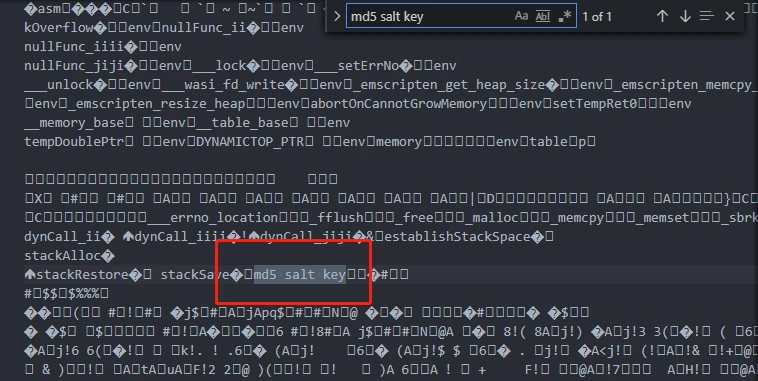
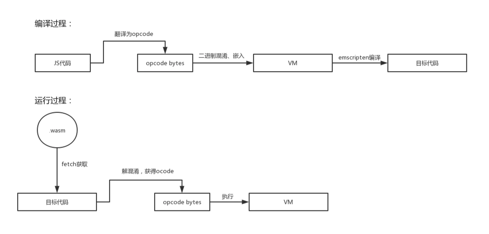

打造基于WASM的高性能安全沙盒
----

通过上一篇文章对 Emscripten 的使用介绍，大家应该具备一定的使用 Emscripten 工具链开发相关 WebAssembly 项目的基础能力了。在本文中，我们将继续通过具体案例更深入地了解 Emscripten 的使用技巧，同时加强对 WebAssembly 二进制格式、Low-Level 编译目标及接近 Native 执行效率的理解。

### 前端核心数据加密

Web 技术的开放以及便捷带来了其极高速的发展，但自作者从事 Web 前端相关开发工作以来，并没有听到太多关于前端核心数据加密的方案，因此“前端数据无加密”慢慢的也变成了业界的一个共识。但在某些日常开发的场景中，我们又会涉及到相当强度的前端核心数据加密的问题，特别是需要在于后端的数据通信上面（包括 HTTP、HTTPS 以及 WebSocket 的数据交换），例如前端日志数据加密就是一个典型的场景。


针对于此类需求，在以往的实践中我们通常使用纯 JavaScript 实现的 Crypto 库来对相关数据加密，同时使用 UglifyJS、Google Closure Compiler 等混淆器进行相关加密代码的混淆，以增加对应的破译难度。但在目前的实践之中由于浏览器自身的调试工具逐渐方便且强大，因此此类方法的安全性变得越来越脆弱。


考虑到这种情况，越来越多的公司开始将前端核心数据加密的相关逻辑迁移至 WebAssembly，依靠 WebAssembly 在整个过程中的编译及二进制特性来提高对应数据加密逻辑的安全性，以此保障业务安全。对于这种方案而言，由于我们可以将 WebAssembly 视作一个全新的 VM，其他语言通过相关工具链（例如 Emscripten）来产出此 VM 可执行的代码，其安全性相比于单纯的 Crypto 库加 JavaScript 混淆器而言具有比较明显的优势。


现在让我们就着手实现一个非常简单的 WebAssembly 签名加密模块来进行一下对应的体验。首先，创建相关的项目，同时下载 Github 上的某 MD5 实现到本项目的 vendor 文件夹中，整体目录结构如下所示：

```shell
├main.c
├CMakeList.txt
├vendor
    ├─base64
    │    └─CMakeList.txt
    │    └─base64.c
    │    └─base64.h
    └─md5
        └─CMakeList.txt
        └─md5.c
        └─md5.h
```

接着我们依照上一章的 CMake 文件进行稍加修改，增加对此 MD5 库的编译链接，如下所示：

```cmake
cmake_minimum_required(VERSION 3.15) # 根据你的需求进行修改
project(sample C)

set(CMAKE_C_STANDARD 11) # 根据你的C编译器支持情况进行修改
set(CMAKE_EXECUTABLE_SUFFIX ".html") # 编译生成.html

include_directories(${PROJECT_SOURCE_DIR}/vendor) # 使得我们能引用第三方库的头文件
add_subdirectory(${PROJECT_SOURCE_DIR}/vendor/md5)
add_subdirectory(${PROJECT_SOURCE_DIR}/vendor/base64)

add_executable(sample main.c)

# 设置Emscripten的编译链接参数，我们等等会讲到一些常用参数
set_target_properties(sample PROPERTIES LINK_FLAGS "\
    -s EXIT_RUNTIME=1 \
    -s EXPORTED_FUNCTIONS=\"['_sign']\"
")

target_link_libraries(sample md5 base64) # 将第三方库与主程序进行链接
```

最后实现我们的数据签名逻辑即可，代码如下：

```c++
#include <stdio.h>
#include "md5/md5.h"
#include "base64/base64.h"

const char* salt_key = "md5 salt key";

#ifdef __EMSCRIPTEN__
int sign(const char* msg, int len, char *output){
    int data_len = strlen(salt_key) + len + 1;
    char *data = malloc(data_len);
    memset(data, 0, data_len);
    memcpy(data, msg, len);
    memcpy(data + len, salt_key, strlen(salt_key));

    uint8_t result[16] = {0};
    md5((uint8_t *)data, strlen(data), result);

    char *encode_out = malloc(BASE64_ENCODE_OUT_SIZE(16));
    base64_encode(result, 16, encode_out);
    memcpy(output, encode_out, BASE64_ENCODE_OUT_SIZE(16));
    free(encode_out);

    return 0;
}
#endif
```

在这里我们使用了上一章介绍的Memory Copy的方式来进行结果数据的传递，因此我们的 JavaScript 代码调用应如下所示：

```javascript
const str = intArrayFromString("your data here");
const ptr = allocate(str, "i8", ALLOC_NORMAL);
const output = Module._malloc(1024);
Module._sign(ptr, str.length, output);
console.log(UTF8ToString(output)); // O6VFgoqQiF52FYyH4VmpPQ==
```

在sign的具体实现中我们可以看到，为了增加整体的安全性，我们对其中的内容进行了“加盐”处理。这种操作看起来万无一失，但是实际上我们稍加分析是可以拿到对应的“盐”值的。现在我们将生成的 sample.wasm 文件拖入到编辑器中，然后搜索md5 salt key，我们可以很顺利的得到对应的“盐”值。

<div align="center">
	
	<p style="font-size:12px;">WebAssembly 无法隐藏所有信息</p>
</div>

针对于这种情况，我们可以进一步使用异或等算法对“盐”值进行相关的处理来达到更深度的处理，但对于需要更高强度的核心数据保护的应用而言这也不过是叠加的障眼法，在这里我们需要更可靠的方式来达到我们的需求。

### 沙盒保护

沙盒保护的思路比较直接：为了更好的达到代码整体保护的目的，我们会自行创建一个完全独立的代码执行环境。在这个独立环境中，我们根据我们的需求限制内部代码使用的 built-in API 从而达到完全可控的状态。与此同时，只要我们符合执行代码的相关规范，那么我们可以自行设计相关的 Opcode 及 IR，来达到防逆向的目的。针对于前端环境而言，其整体流程如下所示：

<div align="center">
	
	<p style="font-size:12px;">沙盒保护的编译/运行过程</p>
</div>

由于整个前端环境大部分都依靠于 JavaScript，因此在沙盒环境上我们有非常多的选择，在本章中我们采用 QuickJS 来进行相关的介绍和演示。如果有其他的沙盒环境需求，可以参考本章的相关思路来进行适当的修改。


QuickJS 想必大家都不会陌生，其作者 Fabrice Bellard 编写了 TinyCC/TinyGL/FFmpeg/JSLinux 等多个知名项目。QuickJS 实现精小，几乎完整支持 ECMA2019，同时具有极低的启动速度有优秀的解释执行性能。在使用 QuickJS 完成我们的沙盒之前，我们先简单的了解一下 QuickJS 的相关 API，然后再使用 Emscripten 来对其进行编译完成我们的整个示例。


首先我们对 CMake 进行相关修改，增加对 QuickJS 的编译链接支持，如下所示：

```cmake
cmake_minimum_required(VERSION 3.15)
project(sample C)

set(CMAKE_C_STANDARD 11)
include_directories(${PROJECT_SOURCE_DIR}/vendor)
add_subdirectory(${PROJECT_SOURCE_DIR}/vendor/quickjs)

add_executable(sample main.c)

target_link_libraries(sample quickjs)
```

然后我们先通过"Hello World"的输出示例来完成整个项目的初始化，代码如下：

```c++
#include "quickjs/quickjs.h"

int main() {
    JSRuntime *rt = JS_NewRuntime();
    JSContext *ctx = JS_NewContext(rt);
    JSValue value = JS_Eval(ctx, "'Hello World!'", 12, "<sandbox>", 0);
    printf("%s\n", JS_ToCString(ctx, value)); // Hello World!
    JS_FreeContext(ctx);
    JS_FreeRuntime(rt);
    return 0;
}
```

现在，对于沙盒内部的 JavaScript 代码而言，我们将会暴露出一个名为 crypto 的全局函数，此函数会对传入的字符串进行 MD5 的相关加密，并且返回给外部环境，其内部 JavaScript 代码如下所示：

```javascript
const MD5_SALT_KEY = 'md5 salt key';
function md5(str) {
  // MD5的相关算法实现
  // 此处逻辑你可以引入npm上的相关库
  // 然后使用Webpack/Parcel等工具进行编译
}

function crypto(str) {
  str = `${str}${MD5_SALT_KEY}`;
  return md5(str);
}
```

QuickJS 要调用对应的内部全局 crypto 函数很简单，我们使用 JS_Eval 即可完成：

```c++
#include <string.h>
#include "quickjs/quickjs.h"

const char* JS_CODE = "const MD5_SALT_KEY = 'md5 salt key';\n"
                      "function md5(str) { return str; }\n"
                      "function crypto(str) {\n"
                      "  return md5(`${str} ${MD5_SALT_KEY}`);\n"
                      "};";

int main() {
    JSRuntime *rt = JS_NewRuntime();
    JSContext *ctx = JS_NewContext(rt);
    JS_Eval(ctx, JS_CODE, strlen(JS_CODE), "<sandbox>", 0);
    JSValue value = JS_Eval(ctx, "crypto('data')", 14, "<sandbox>", 0);

    printf("%s\n", JS_ToCString(ctx, value)); // data md5 salt key
    JS_FreeContext(ctx);
    JS_FreeRuntime(rt);
    return 0;
}
```

运行我们的代码，我们可以看到，当调用执行结束后其正确的输出了相关内容。接下来我们对目前的实现加入部分 Emscripten 的胶水代码并进行 WebAssembly 的编译，从而使得我们能从 Web 端或 NodeJS 进行相关的执行，调整后的 CMake 如下所示：

```cmake
cmake_minimum_required(VERSION 3.15)
project(sample C)

set(CMAKE_C_STANDARD 11)
set(CMAKE_EXECUTABLE_SUFFIX ".html") # 编译生成.html

include_directories(${PROJECT_SOURCE_DIR}/vendor)
add_subdirectory(${PROJECT_SOURCE_DIR}/vendor/quickjs)

add_executable(sample main.c)

set_target_properties(sample PROPERTIES LINK_FLAGS "\
    -s EXIT_RUNTIME=0 \
    -s EXPORTED_FUNCTIONS=\"['_init', '_eval', '_dispose']\"
")

target_link_libraries(sample quickjs)
```

接着，我们调整我们的 C++部分代码如下：

```c++
#include <string.h>
#include "quickjs/quickjs.h"

static JSRuntime *rt;
static JSContext *ctx;

const char* JS_CODE = "const MD5_SALT_KEY = 'md5 salt key';\n"
                      "function md5(str) { return str; }\n"
                      "function crypto(str) {\n"
                      "  return md5(`${str} ${MD5_SALT_KEY}`);\n"
                      "};";

int init(){
    rt = JS_NewRuntime();
    ctx = JS_NewContext(rt);
    JS_Eval(ctx, JS_CODE, strlen(JS_CODE), "<sandbox>", 0);
    return 0;
}

int eval(const char *str, int len, char *output){
    JSValue  value = JS_Eval(ctx, str, len, "<sandbox>", 0);
    const char *retstr = JS_ToCString(ctx, value);
    memcpy(output, retstr, strlen(retstr));
    JS_FreeValue(ctx, value);
    return 0;
}

int dispose(){
    JS_FreeContext(ctx);
    JS_FreeRuntime(rt);
    return 0;
}
```

最后我们进行相关编译，然后使用如下代码进行相关的调用：

```javascript
const datastr = "data";
const buffer = intArrayFromString(datastr);
const ptr = allocate(buffer, 'i8', ALLOC_NORMAL);

const output = Module._malloc(1024);
Module._init();
Module._eval(ptr, buffer.length, output);
Module._dispose();
console.log(UTF8ToString(output)); // output: data md5 salt key
```

根据上一章的实践我们知道，由于我们的内部 JavaScript 代码是以字符串的方式直接进行呈现和编译的，因此如果我们对 Emscripten 编译生成 WASM 文件进行二进制查看的话，我们仍然能还原出我们的实际相关实现。同时根据我们的流程来看，我们首先需要将其 JavaScript 内容编译为 Opcode，然后再进行相关的嵌入才较为合理。要想得到 QuickJS 的 Opcode ByteStream 比较简单，直接通过 qjc 即可获得：

```shell
> cd quickjs
> make all
> ./qjsc -c index.js
> cat out.c
```

通过查找 out.c 我们可以看到 qjsc 为我们生成了如下的代码：

```c++
/* File generated automatically by the QuickJS compiler. */

#include <inttypes.h>

const uint32_t qjsc_index_size = 209;

const uint8_t qjsc_index[209] = {
 0x02, 0x06, 0x18, 0x4d, 0x44, 0x35, 0x5f, 0x53,
 0x41, 0x4c, 0x54, 0x5f, 0x4b, 0x45, 0x59, 0x06,
 0x6d, 0x64, 0x35, 0x0c, 0x63, 0x72, 0x79, 0x70,
 // ......
};
```

其中的 qjsc_index 数组就是我们 JavaScript 代码对应的 Opcode ByteStream。接着我们修改我们的代码，然后调整执行的方法，其代码如下：

```c++
const uint8_t JS_CODE[209] = {
 0x02, 0x06, 0x18, 0x4d, 0x44, 0x35, 0x5f, 0x53,
 0x41, 0x4c, 0x54, 0x5f, 0x4b, 0x45, 0x59, 0x06,
 0x6d, 0x64, 0x35, 0x0c, 0x63, 0x72, 0x79, 0x70,
 // ......
};

int init(){
    rt = JS_NewRuntime();
    ctx = JS_NewContext(rt);
    JS_Eval(ctx, JS_CODE, 209, "<sandbox>", JS_EVAL_TYPE_MODULE);
    return 0;
}
```

最后我们同样进行整体编译，然后尝试相同调用，可以看到其执行正常。同时查看 WASM 文件我们已经无法顺利查看到内部执行 JavaScript 代码内容了（已变为 QuickJS 的 Opcode ByteStream）。

### 总结

在本章我们较为详细的介绍了前端加密及代码保护的困境，以及如何使用 WebAssembly 并结合 QuickJS 打造高性能安全沙盒的相关介绍，关于 QuickJS 的更进一步的内容可以参考其官方网站。在下一章中，我们将使用 WebAssembly 结合 WebGL 来进行一些图形相关的实践，同时对比其在此领域相比 JavaScript 的优劣势。