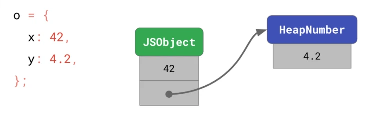
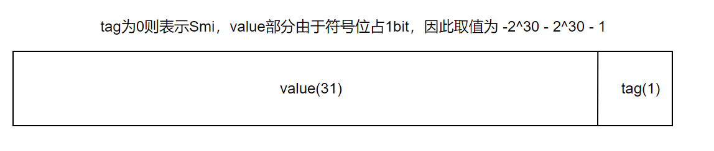
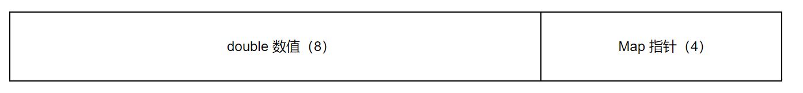
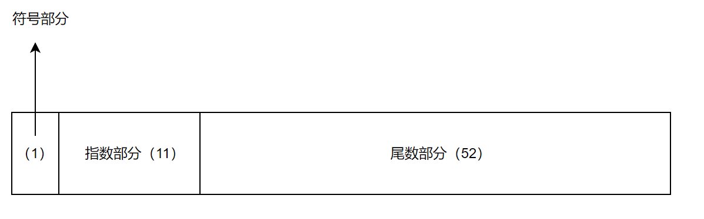
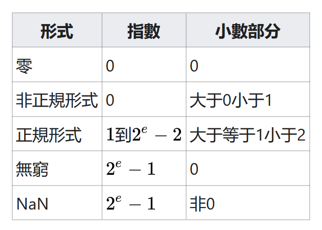
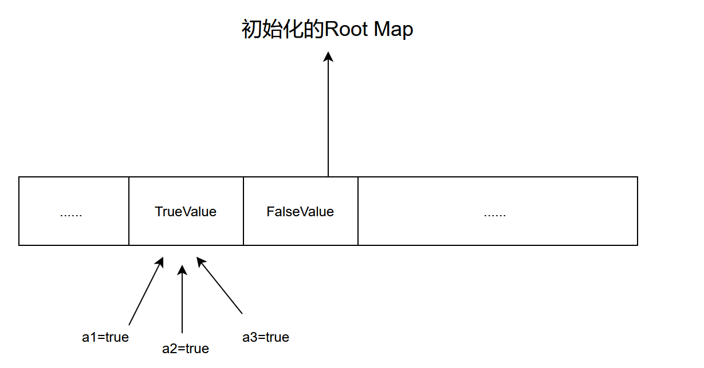

Smi和HeapNumber
---

> 本文所述实现仅基于V8 2.0.2.1版本，若后续版本有差异请以后续版本为主

在标准中，ECMAScript的Number类型都是Boxed Object（尽管有字面量和Number构造函数之分），如果完全按照规范无脑实现，那么类似于下面的伪代码：

```c++
class Number: public Object {
    double value;
}
```

但这样的实现会存在一些问题：
1. 所有Number对象均需要分配在堆上，持有一个Number对象需要4字节 + 8字节的大小（32位）；
2. 分配更多的对象，浪费了更多的CPU缓存，对应的存取性能相比纯数值的存取更慢；

但现实的开发过程中，我们的程序会被V8基于两个假设进行优化：
1. 更常使用较小数值的整数，而不是更大的整数值或浮点数；
2. 我们访问过的数值会在后续频繁地存取，程序的局部性特点很强；

因此V8针对Number类型进行了拆分：Smi 和 HeapNumber

```javascript
// 在32位系统下，Smi的取值范围为 -2^30 ~ 2**30 - 1
 -Infinity // HeapNumber
-(2**30)-1 // HeapNumber
  -(2**30) // Smi
       -42 // Smi
        -0 // HeapNumber
         0 // Smi
       4.2 // HeapNumber
        42 // Smi
   2**30-1 // Smi
     2**30 // HeapNumber
  Infinity // HeapNumber
       NaN // HeapNumber
```

<div align="center">
	
</div>

### Smi如何实现的

Smi的基本想法很简单，即：指针是合法的整形。因此我们可以通过指针转整形来存储一定范围的整数值。

<div align="center">
	
</div>

如果我们通过C++简要来实现相关逻辑则代码如下：

```c++
#include <iostream>

class Object {
    // ......
}

class Smi: public Object {
public:
    inline int32_t value(){
        return static_cast<int32_t>(reinterpret_cast<intptr_t>(this)) >> 1;
    }

    static Smi* fromInt(int32_t value){
        intptr_t tagged_value = (static_cast<intptr_t>(value) << 1) | 0;
        return reinterpret_cast<Smi*>(tagged_value);
    }

    static bool isSmi(Smi* ptr){
        return (reinterpret_cast<intptr_t>(ptr) & 1) == 0;
    }
};

int main() {
    int32_t value = 23333;
    Smi* smi = Smi::fromInt(value);
    std::cout << "is smi: " << Smi::isSmi(smi) << std::endl;
    std::cout << "is equal: " << (value == smi->value()) << std::endl;
    return 0;
}
```

### HeapNumber如何实现的

在V8中，HeapNumber的继承关系如图所示：

```c++
class Object {
public:
  static const int32_t kHeaderSize = 0;
}

class HeapObject: public Object {
public:
 static const int32_t kHeaderSize = Object::kHeaderSize + 4;  // 必须的指针长度
}

class HeapNumber: public HeapObject {
public:
 static const int32_t kSize = HeapObject::kHeaderSize + 8; // 指针(4) + double(8)
}
```

其一个HeapNumber对象自身占用12字节内存（在32位系统中），由于GC的原因（Alloc的返回对象均为Object指针），HeapNumber的内存布局直接采用偏移量处理的方式（这里又涉及一个Trick）：

<div align="center">
	
</div>

因此HeapNumber的存取需要自行手工的对内存偏移进行处理，简要实现的代码如下：

```c++
#include <iostream>

const int32_t kHeapObjectTag = 1;

class Object {
public:
    static const int32_t kHeaderSize = 0;

    bool isHeapObject() {
        return (reinterpret_cast<uintptr_t>(this) & 3) == kHeapObjectTag;
    }
};

class HeapObject:public Object {
public:
    static const int32_t kHeaderSize = Object::kHeaderSize + 4;

    void set_map(void* map) {
        uint8_t* ptr = reinterpret_cast<uint8_t*>(this) - kHeapObjectTag;
        *reinterpret_cast<uint32_t*>(ptr) = reinterpret_cast<intptr_t>(map);
    }

    static HeapObject* cast(Object* ptr){
        return reinterpret_cast<HeapObject*>(ptr);
    }
};

class HeapNumber:public HeapObject {
public:
    static const int32_t kSize = HeapObject::kHeaderSize + 8;
    static const int32_t kValueOffset = HeapObject::kHeaderSize;

    void set_value(double value) {
        uint8_t *ptr = reinterpret_cast<uint8_t *>(this) + kValueOffset - kHeapObjectTag;
        *reinterpret_cast<double *>(ptr) = value;
    }

    double value() {
        uint8_t *ptr = reinterpret_cast<uint8_t *>(this) + kValueOffset - kHeapObjectTag;
        return *reinterpret_cast<double *>(ptr);
    }

    static HeapNumber* cast(Object* ptr) {
        return reinterpret_cast<HeapNumber *>(ptr);
    }
};

Object* AllocateRaw(size_t size) {
    return reinterpret_cast<Object *>(malloc(size)) + kHeapObjectTag;
}

int main() {
    Object* result = AllocateRaw(HeapNumber::kSize);
    // 实际上这里源码是塞入了 heap_number_map()
    // map结构比较复杂，我们暂时略去以后讲，这里并不重要
    HeapObject::cast(result)->set_map(malloc(4));
    HeapNumber::cast(result)->set_value(2.3333);
    std::cout << "is HeapObject: " << result->isHeapObject() << std::endl;
    std::cout << "value: " << HeapNumber::cast(result)->value() << std::endl;
    return 0;
}
```

在这里我们注意到不管是在AllocateRaw，还是HeapNumber的set_value及value方法调用过程中，除了自身偏移的4字节外还额外的偏移了1个字节。并且我们也不难发现，对应的1字节在isHeapObject中起到了对应的作用，这是为什么呢？原因是：V8通过内存地址4字节对齐的特点（32位系统），减少了1字节的成员属性存储的开销。

那什么叫内存地址4字节对齐呢？简单来说就是每个内存地址是占用4个字节的，如果我们从0开始，那么下一个内存的地址就是4、8、12、16...从这里我们看到，对应内存地址至少低2位是无法被利用的，比如我们将4字节写成二进制数的话就是：


```shell
...00000000 00000000 00000000 00000100
```

从上面你可以看到第三位为1，但是低两位一定会是0，因此如果我们对低两位进行操作的话，并不会造成非法操作，在这里V8就是利用了这个特性用低位01来判断是否是一个HeapObject，因此我们可以像Smi一样得到更完整的HeapObject内存布局：

<div align="center">
	
</div>

那为什么要大费周折的这么做呢？毕竟2022年手机内存都标配8G了，我们也不差1字节内存呀！其实是因为由于JavaScript是弱类型语言，其很多内部函数都需要判断对象的类型然后再进行对应操作，因此判断类型这个操作真的太太太频繁了。不管是从内存还是CPU缓存中去读取都比位操作而言耗费更多时间，秉持能省则省的原则，我们就势必需要这么极致的优化了。

### NaN和Infinity

如果有细心的同学话，一定会注意到在Smi的分类中，NaN和Infinity被归属到了HeapNumber，那为什么不是用一个枚举类型或者标志位来表示呢？为什么要让NaN和Infinity搞成一个HeapNumber，带一个这么大的double类型来浪费呢？如果想知道这个问题，我们需要深入到IEEE754标准里面去。

我们知道对于JavaScript的Number类型而言，其实质就是一个64位的浮点数类型。对于64位浮点数的标准我们通常遵循IEEE754，其对应表示如下：

<div align="center">
	
</div>

其计算公式如下：

^a*2^{(b+1023)}*(1+\frac{c}{2^{51}}))

但实际上IEEE754有一套自己的规则，其总结起来就是：

<div align="center">
	
</div>

大家可以看到，实际上对于double而言，我们完全利用IEE754自身的规则来进行NaN和Infinity的表达，因此自然而言NaN和Infinity就归属到了HeapNumber中了。

### 题外话：Boolean、undefined以及null

我们知道，对于布尔值而言其True及False完全可以由数值1和0来代表，那么在V8里关于Boolean的实现逻辑是使用Smi还是HeapNumber来表示呢？实际上在V8的实现中，Boolean既不是Smi也不是HeapNumber，而是一个Heap::true_value和Heap::false_value。于此同时对应的undefined及null也采用了相同的实现，指向了Heap::undefined_value和Heap::null_value。这里的Heap::*_value实际上等价于某个Map对象（HeapNumber也含有一个Map指针），因此你程序里的Boolean值都通通指向了一个相同的Map对象，如图所示：

<div align="center">
	
</div>
Map是非常重要的结构，他决定了对象的类型、大小、原型甚至面试八股文里面常聊的HiddenClass，我们会在后续多篇中来进行剖析。
