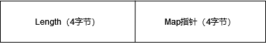
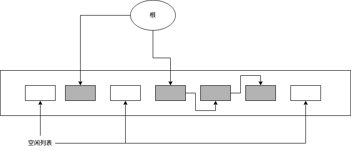
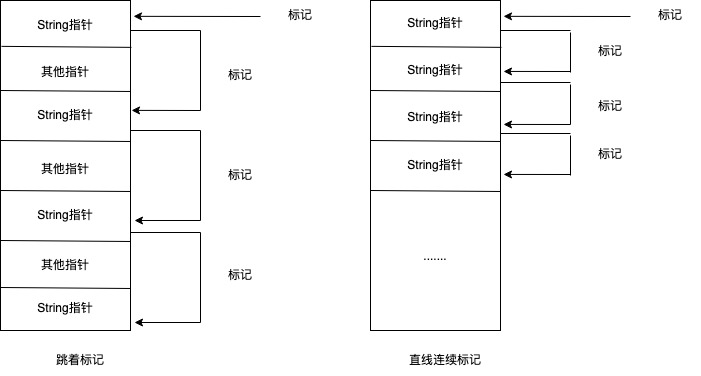
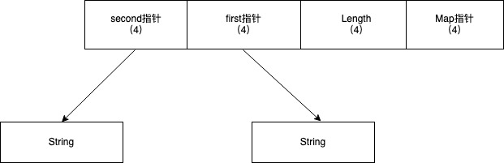

## 字符串的优化

> 本文所述实现仅基于 V8 2.0.2.1 版本，若后续版本有差异请以后续版本为主

在讲述完 Number、NaN、null 及 undefined 之后，我们一起来探究一下 V8 里基础数据中字符串的相关优化。在 JavaScript 的程序里，字符串是无所不在的，它贯穿了我们数据和代码的每一个角落，由于它确实太常用了，我们不得不对其做一些相关优化以保证我们整个程序的性能。

首先让我们来看一看 ECMAScript 规范对字符串的定义，其表述如下：

> The String type is the set of all finite ordered sequences of zero or more 16-bit unsigned integer values
> (“elements”).

这段描述里有两个地方需要我们特别注意：

1. finite ordered sequences
2. 16-bit unsigned integer values

finite ordered sequences 说明我们的字符串是自适应长度且有序的序列，16-bit unsigned integer 代表着每个字符单元占用了双字节（即 UTF-16）。因此如果我们无脑按照规范来实现我们的字符串类的话则代码如下：

```c++
class String {
    uint32_t length;
    uint16_t* data;
}
```

规范的这种定义带来了非常多的好处，比如：由于我们的每个字符单元占用双字节，因此最大值可以存储到 65536，在这个范围内大部分的文字（比如中文）都可以直接被存储，非常方便且高效。但事物总归会有两面性，这种定义也会带来非常多的问题：

1. 双字节的设计可以很容易容纳大部分字体，但是对于仅使用 ASCII 字符的地区，这无疑会造成非常大的内存浪费（ASCII 单元只需要一个字节即可）；
2. 我们现在字符编码主流为 UTF-8，UTF-16 的设计对于使用者而言不太友好，需要使用者自行考虑对应的编码转换；
3. ......

对应这些诸多的情况，V8 内部会在符合规范的基础上对 ASCII 和 UTF-8 做特殊处理，自动判断对应字符串的类型，然后采取不同的优化策略进行处理。除此之外，假如我们不考虑上面的问题真的如上所属的代码进行无脑实现，那么其在字符串的连接等操作上也会非常的浪费性能，因为这种做法会频繁涉及到内存的申请、复制、销毁。我们知道，当你的程序涉及到这些内存操作时是会非常影响性能的，所以 V8 也针对性的对于这种情况进行了特殊处理。

在 V8 2.0.2.1 版本中，字符串类的继承关系可以概括如下：

```c++
//  - String
//    - SeqString
//      - SeqAsciiString
//      - SeqTwoByteString
//    - ConsString
//    - ExternalString
//      - ExternalAsciiString
//      - ExternalTwoByteString
```

接下来我们就一起来逐步分析其每个类型所采用的优化思路和考量吧。

> 实际上 V8 对应字符串的优化思路非常直接且好懂，其用到的数据结构和算法非常简单，相比于面试常考的 “接雨水” 此类算法题而言其理解难度低很多很多，因此你无须害怕和紧张，让我们先深呼吸一口气继续探究吧。

### String 的实现

String 类是所有字符串类的父类，在 V8 的实现中，实际上所有字符串子类在对外使用时都会被“里氏替换”为父类 String 来使用。在我们第一章的学习中我们知道，在 V8 的实现中存在 HeapObject 这个基类，其相关占用的内存主要由 GC 管理。在这里，由于 String 类需要涉及到堆内存的申请和释放，因此其必然是 HeapObject 的子类。那么对于 HeapObject 的子类而言，我们必然需要对其考虑内存布局，代码简要实现如下：

```c++
class Object {
public:
    static const int32_t kHeaderSize = 0;
};

class HeapObject: public Object {
public:
    static const int32_t kHeaderSize = Object::kHeaderSize + 4;
};

class String:public HeapObject {
public:
    static const int kLengthOffset = HeapObject::kHeaderSize;
    static const int kSize = kLengthOffset + 4;
};
```
通过我们上一章的学习，我们能够很轻松的画出 String 的内存布局，图如下：

<div align="center">
	
</div>

那字符串的相关数据并不在我们的内存布局当中，他们究竟放在哪里呢？这个要分情况讨论， SeqString 和 ConsString 的情况并不一致，在 V8 中会进行独立的处理和优化，这个我们在后面的讨论中可以看到。但无论如何，从上面的内存不居中我们可以知道，String 里肯定会包含 length 和 set_length 两个基本方法，在这里我们简要的实现一下相关方法，代码如下：

```c++
class String:public HeapObject {
  inline int length() {
    uint32_t len = READ_INT_FIELD(this, kLengthOffset);
    return len >> (StringShape(this).size_tag() + kLongLengthShift);
  }

  inline void set_length(int value) {
    WRITE_INT_FIELD(
        this,
        kLengthOffset,
        value << (StringShape(this).size_tag() + kLongLengthShift
    );
  }
}
```

整体逻辑都比较易懂，除了意外出现的 StringShape 类，这个我们在本章的题外话中再简要聊聊。需要注意的是，在V8 2.0.2.1版本中，32位系统字符串最长长度为2^30-1，剩余的2位用于了字符串各种子类型的判断，这个技巧我们在前一章有描述过，在这里我们就不继续聊了（尽管标准说字符串长度是无限制的，但2^30-1长度的字符串大小已经超过了32位V8运行时的最大内存，所以严格来说这里并不符合标准，但现实中我们也大概率用不上不会用到这么大的字符串，因此我们勉强可以说这符合标准）。
### SeqString 的实现

SeqString 的实现总体很简单，其在 String 内存布局的基础之上增加了一块连续内存用来存放对应的字符串相关数据，其内存布局如下图所示：

<div align="center">
	
</div>

从规范我们知道，JavaScript 内部存放的是 UTF-16 单元，因此 Data 顺理成章的就是一块uint16的堆内存序列了，那么整体的想法就和我们想的设计不谋而合，简化代码如下：

```c++
class SeqString {
    uint32_t length;
    uint16_t* data;
}
```

但我们也注意到，SeqString 有两个子类分别叫做 SeqAsciiString 和 SeqTwoByteString，从名字上我们能够知道，一个是专门为 ASCII 做优化的设计，其存放的是 uint8 内存序列，而另一个 SeqTwoByteString 就是直接的 uint16 内存序列的实现。这么做的道理很简单，因为对于 ASCII 而言，其只需要 uint8 单元即可进行存放，如果我们使用 uin16 单元来进行存放 ASCII 的话，这实际上有点太过于浪费了，况且在目前的使用中大量的相关信息都是以英文为主，所以针对 ASCII 进行优化是有必要的。那你可能会问，现在不都是使用 UTF-8 编码了么？其实我们稍微了解相关知识就可以知道 UTF-8 编码是完全兼容于 ASCII 的，因此对于这块而言并不会带来什么问题，这块从创建一个 SeqString 的相关代码中我们也能看到：

```c++
Object* Heap::AllocateStringFromUtf8(
  Vector<const char> string,
  PretenureFlag pretenure
) {
  // Count the number of characters in the UTF-8 string and check if
  // it is an ASCII string.
  Access<Scanner::Utf8Decoder> decoder(Scanner::utf8_decoder());
  decoder->Reset(string.start(), string.length());
  int chars = 0;
  bool is_ascii = true;
  while (decoder->has_more()) {
    uc32 r = decoder->GetNext();
    if (r > String::kMaxAsciiCharCode) is_ascii = false;
    chars++;
  }

  // If the string is ascii, we do not need to convert the characters
  // since UTF8 is backwards compatible with ascii.
  if (is_ascii) return AllocateStringFromAscii(string, pretenure);

  Object* result = AllocateRawTwoByteString(chars, pretenure);
  if (result->IsFailure()) return result;

  // Convert and copy the characters into the new object.
  String* string_result = String::cast(result);
  decoder->Reset(string.start(), string.length());
  for (int i = 0; i < chars; i++) {
    uc32 r = decoder->GetNext();
    string_result->Set(i, r);
  }
  return result;
}
```

上面的逻辑简单来说就是，创建一个字符串对先前会对字符串的所有字符进行遍历，判断是完全的 ASCII 还是 UTF-8 编码，如果是完全的 ASCII字符串那么直接调用 AllocateStringFromAscii 方法进行 SeqAsciiString 的创建，如果是 UTF-8 编码，那么就创建对应的 SeqTwoByteString 实例，并解析 UTF-8 单元将其一个一个填充到对应的 UTF-16 单元中。

当然到这里还没有完全结束，在不管是调用 AllocateStringFromAscii 还是 AllocateRawTwoByteString 的代码中我们都可以看到 V8 还根据对应字符串的长度进行了分类：
- Short String（长度小于等于63）
- Medium String（长度小于等于16383且大于63）
- Long String（长度大于16383且小于2^30-1）

其代码片段如下：
```c++
Object* Heap::AllocateRawTwoByteString(int length, PretenureFlag pretenure) {
  // ....

  // 根据字符串的对应长度决定对于的map指向
  Map* map;
  if (length <= String::kMaxShortSize) {
    map = short_string_map();
  } else if (length <= String::kMaxMediumSize) {
    map = medium_string_map();
  } else {
    map = long_string_map();
  }

  // ....
}
```

按照字符串长度进行分类的目的有两个：
- 为了更好的方便 GC 进行标记，
- 对于某些方法（比如 Hash）能够更好的进行独立优化

我们在这里只简要介绍为何能够方便 GC 标记，对于方法的独立优化的解释请查看下方的题外话：String Hash了解。如果有了解过 V8 GC 的朋友应该知道 V8 的 GC 是混合式的精准GC ，其包含了分代GC、GC复制、GC标记-清除、GC标记-压缩等多个相关算法。对于传统的标记清除算法而言，有两个最大的问题是：
- 内存的碎片化
- 跳跃式访问标记

简单理解可以由如下图所示：

<div align="center">
	
</div>

为了解决这个问题，V8 的 GC 的处理方式是将所有需要 GC 管理的类及其子类都进行详细的分类，将对应同样类型的实例都存放在一起，这样的话就能够进行连续的标记，而避免跨越式的访问和内存碎片化，如图所示：

<div align="center">
	
</div>


### ConsString 的实现

ECMAScript 里规定了对应的字符串是不可变的，所以当使用了对应的字符串操作时，其返回的总是新的字符串：

```javascript
var a = 'a';
var b = 'b';
console.log(a + b); // new string instance: 'ab'
```
在实际的程序里面，字符串的连接操作是一个非常常用的操作，按照常规的实现思路，如果我们要将两个字符串连接生成一个新的字符串，那么最简单的方式就是申请一块新的内存（长度为两个操作字符串长度之和），然后将操作字符串逐字符进行拷贝。这样的做法对于长度较小的字符串是没有太多问题的，但是如果字符串的长度达到了 Medium 或者 Long，这样的操作的耗时就难免较长，因此在V8里面针对这种情况进行了优化，编写了 ConsString 用来解决此类问题。

ConsString 的优化思路很简单，其采用二叉树的方式来生成一个全新的字符串实例，其内存布局如图所示：

<div align="center">
	
</div>

通过这种方式，其避免了 Medium / Long字符串的内存申请及其拷贝的消耗，有效的增强了字符串连接的性能，对应的代码如下：

```c++
Object* Heap::AllocateConsString(String* first, String* second) {
  int first_length = first->length();
  if (first_length == 0) {
    return second;
  }

  int second_length = second->length();
  if (second_length == 0) {
    return first;
  }

  int length = first_length + second_length;

  // 如果对应长度小于kMinNonFlatLength（13），则直接走SeqString的逻辑
  if (length < String::kMinNonFlatLength) {
   // ......
  }
  
  // 否则走二叉树的ConsString逻辑
  Object* result = Allocate(
    map,
    always_allocate() ? OLD_POINTER_SPACE : NEW_SPACE
  );

  if (result->IsFailure()) return result;
  ConsString* cons_string = ConsString::cast(result);
  WriteBarrierMode mode = cons_string->GetWriteBarrierMode();
  cons_string->set_first(first, mode);
  cons_string->set_second(second, mode);
  cons_string->set_length(length);
  return result;
}
```

当然，凡是有利有弊，ConsString 虽然增强了字符串的连接性能，但是在某些字符串方法里却增加了复杂性，比如我们常用的 String.prototype.slice 方法，如果对于切分的字符串一部分在 first 里一部分在 second 里的话，我们的实现就会非常困难，并且对应性能也不会特别好，那因此V8遇到此类情况， 会将 ConsString 进行 Flatten，通过空间换取此类操作的执行性能，代码如下：

```c++
// 仅针对于V8 2.0.2.1版本
// 后续版本创造了SliceString来解决相关性能问题
Object* Heap::AllocateSubString(String* buffer,
                                int start,
                                int end) {
  int length = end - start;

  // ....

  // 如果对应的字符串是ConsString， 则进行Flatten减少访问时间
  if (!buffer->IsFlat()) {
    buffer->TryFlatten();
  }

  // ....

  // 生成全新的字符串进行返回
  if (buffer->IsAsciiRepresentation()) {
    ASSERT(string_result->IsAsciiRepresentation());
    char* dest = SeqAsciiString::cast(string_result)->GetChars();
    String::WriteToFlat(buffer, dest, start, end);
  } else {
    ASSERT(string_result->IsTwoByteRepresentation());
    uc16* dest = SeqTwoByteString::cast(string_result)->GetChars();
    String::WriteToFlat(buffer, dest, start, end);
  }

  return result;
}
```

那什么样的字符串为 Flatten 字符串呢，其分为两种：
- 所有 SeqString 相关子类
- 类型为 ConsString，但仅有 first 指针有数据，second 指针指向 nullptr

### ExternalString 的实现

ExternalString 在 V8 2.0.2.1中实际上与 SeqString 并没有太多差异，相关内容请参考 SeqString 的描述。

### 题外话一：StringShape

我们知道 String 是 HeapObject 的子类，从上面的内存布局中我们还可以知道其会有4字节的 Map 指针引用。如果我们要判断一个 String 的相关类型的话，我们的对应代码基本上会这样写：
```c++
uint32_t type = HeapObject::cast(this)->map()->instance_type();
if((type & (kIsNotStringMask | kStringRepresentationMask)) == (kStringTag | kConsStringTag)) {
 // something to do...
}
```
我们之前有说过，类型判断操作在 JavaScript 里非常频繁。对于 String 而言其要获取 type 实际上会经过两次内存相关的访问：map() 及 instance_type()，这个消耗看起来非常的不划算，在 V8 的 StringShape 注释里也有相关的注释：

```shell
// The characteristics of a string are stored in its map.  Retrieving these
// few bits of information is moderately expensive, involving two memory
// loads where the second is dependent on the first.  To improve efficiency
// the shape of the string is given its own class so that it can be retrieved
// once and used for several string operations.
```
但在整个 V8 的代码中，我们却基本上看不到缓存 StringShape 实例的代码，而全部都只是将 StringShape 当成一个临时实例在使用，比如：

```c++
if(StringShape(this).IsSymbol()) {
    // ...
}else if(StringShape(this).IsCons()) {
    // ...
}
```

这不免让我们思考：那既然类型的访问这么昂贵，我们为什么不将这个代码修改为：
```c++
StringShape shape = StringShape(this)
if(shape.IsSymbol()) {
    // ...
}else if(shape.IsCons()) {
    // ...
}
```
甚至我们还可以在 StringShape 中做各种字段的缓存以便重复使用。其原因在于 ConsString 和 GC，正如对应注释里说到：
```shell
// but be aware that flattening a string can potentially alter its shape.  
// Also be aware that a GC caused by something else can alter the shape of a 
// string due to ConsString shortcutting.  Keeping these restrictions in mind has 
// proven to be error-prone and so we no longer put StringShapes in variables 
// unless there is a concrete performance benefit at that particular point in the code.
```
尽管 StringShape 在性能提升上没有发挥用处，但由于其增强了代码的可读性（比较一下最开头的那个 String 类型判断代码），因此V8至此最新版本仍然保留了 StringShape 的相关实现。

### 题外话二：String Hash

在 JavaScript 里面字符串不仅仅可以作为普通变量使用，实际上对象的 Property 也需要使用到字符串，例如：
```javascript
var obj = {};
obj['a'] = 'a';
obj['b'] = 'b'
```
那这里就出现了一个问题，难不成我们的对象实现里面就真的持有了完整的字符串内容？当我们获取对应值的时候岂不是会涉及到字符串逐字符比较，那不是慢到爆炸？这个问题实现者当然也想到了，解决办法的是将其转换成 Int 类型的 Hash，在后续的比较中通过 Hash 值来进行比较。所以在 String 中编写了 Hash、ComputeAndSetHash 等方法，对应的定义如下：

```c++
class String: public HeapObject {
  inline uint32_t Hash();

  static uint32_t ComputeLengthAndHashField(
    unibrow::CharacterStream* buffer, 
    int length
  );
}
```

上述代码中的 unibrow 实际上是 V8 早期自己实现的 Unicode 库，在后续的V8版本中已被替换为 ICU，其具体实现对于我们而言并不重要，我们只需要知道其保存了 Unicode 的字符流即可。首先让我们看看 Hash 方法：

```c++
inline uint32_t String::Hash() {
   // Fast case: has hash code already been computed?
  uint32_t field = length_field();
  if (field & kHashComputedMask) return field >> kHashShift;
  // Slow case: compute hash code and set it.
  return ComputeAndSetHash();
}
```

整体代码很清晰，分为了 Fast Path 和 Slow Path 两个部分。但奇怪的是为什么 Fast Path 部分是从 Length 字段里获取相关值然后操作后返回呢？实际上从文章上面的章节内容我们可以知道， String 是被分为 Short/Medium/Long 三种类型，Short/Medium 对应的长度较短（最大值为63和16383），但是 Length 字段是 uint32 类型的，因此对于 Short/Medium 的 String 而言还有部分空间是完全可以利用起来存放 Hash 值的，简单来说字符串计算得出的 Hash 值是和 Length 字段共存的！当然，对于 Long 类型的字符串而言需要有额外的处理，这个我们在下面会介绍，接下来让我们看看 ComputeAndSetHash 的逻辑：
```c++
uint32_t String::ComputeAndSetHash() {
  // Compute the hash code.
  StringInputBuffer buffer(this);
  uint32_t field = ComputeLengthAndHashField(&buffer, length());

  // Store the hash code in the object's length field.
  set_length_field(field);
  return field >> kHashShift;
}
```

从代码中的注释我们可以确认：Hash 值确实是和 Length 字段是放一起的。而如果要了解对应的计算逻辑的话，就让我们看一看 ComputedLengthAndHashField 方法，其代码如下：
```c++
uint32_t String::ComputeLengthAndHashField(
    unibrow::CharacterStream* buffer,
    int length
) {
  StringHasher hasher(length);

  // Very long strings have a trivial hash that doesn't inspect the
  // string contents.
  if (hasher.has_trivial_hash()) {
    return hasher.GetHashField();
  }

  // Do the iterative array index computation as long as there is a
  // chance this is an array index.
  while (buffer->has_more() && hasher.is_array_index()) {
    hasher.AddCharacter(buffer->GetNext());
  }

  // Process the remaining characters without updating the array
  // index.
  while (buffer->has_more()) {
    hasher.AddCharacterNoIndex(buffer->GetNext());
  }

  return hasher.GetHashField();
}
```
这里新出现了一个 StringHasher 类，这个类对于 String 的内容使用了名为 [Jenkins One-At-A-Time Hash Funcation](https://en.wikipedia.org/wiki/Jenkins_hash_function) 的算法进行了快速的Hash计算。在这里我们不免会有疑问，Hash 计算对于 Short/Medium 的 String 尚可还行得通，但是我们有说到 String 的最大长度可以达到2^30-1（针对于32位），如果我的一个字符串达到了这个长度的话，假设忽略 Hash 的计算性能，对应的 Hash 值也应该达到 Length 的存储最大值了，我们又说过 Hash 是和 Length 字段共存的，那这样岂不是会将 Length 字段进行覆写，我们之后获取 String 的长度该怎么办呢？V8 的解决办法是：对于 Long String 我们直接将 Length 作为整个 String 的 Hash 进行使用，代码如下：
```c++
static inline uint32_t HashField(uint32_t hash, bool is_array_index) {
  uint32_t result = (hash << String::kLongLengthShift) | String::kHashComputedMask;
  if (is_array_index) result |= String::kIsArrayIndexMask;
  return result;
}

uint32_t StringHasher::GetHashField() {
  if (length_ <= String::kMaxShortSize) {
      // ...
  } else if (length_ <= String::kMaxMediumSize) {
      // ...
  } else {
    // 对于Long String，则直接使用Length字段作为Hash来使用
    // 对应了ComputeLengthAndHashField中的注释：
    // 'Very long strings have a trivial hash that doesn't inspect the
    // string contents.'
    return v8::internal::HashField(length_, false);
  }
}
```
但如果我们往深想一下，这样的处理难道不会 Hash 碰撞情况十分多么？比如对于下面的代码：
```javascript
// 测试环境 V8 2.0.2.1 32位
var key1 = new Array(16384).fill(0).join('');
var key2 = new Array(16384).fill(1).join('');
var obj = {};
obj[key1] = 0; // force to compute hash
obj[key2] = 1; // force to compute hash
console.log(key1 == key2) // output: false
```

对于这段简单的代码，我们很自然就会知道它的输出就应该是false才对，但如果按照上面的逻辑，对于大于长度16383的 Long String，如果我们对其做比较，由于 Length 就是对应字符串的 Hash 值，输出结果不就应该是true才对么？实际上V8对于字符串是否相等的比较仍然是逐字符进行比对， Hash 的比较只是作为了一个 Fast Path 来进行了处理，代码如下：
```c++
bool String::SlowEquals(String* other) {
  // Fast check: negative check with lengths.
  int len = length();
  if (len != other->length()) return false;
  if (len == 0) return true;

  // Fast check: if hash code is computed for both strings
  // a fast negative check can be performed.
  if (HasHashCode() && other->HasHashCode()) {
    if (Hash() != other->Hash()) return false;
  }

  // 下面的代码就是针对于不同的String类型进行逐字符的对比处理
  // 相关代码内容太多，我们在这里直接忽略
}
```
在 SlowEquals 方法中，当两者的 Hash 均不相等时其才命中 Fast Path 直接返回 false，这样的话对于相等 Hash 的 Long String，其最终也会落入到逐字符比较的相关逻辑中，而并不会出现上面我们讨论的问题。其他字符串相关的比较方法大致相同，但是也会有一些细微差别，我们在之后的章节里会再回过头来详细讨论。