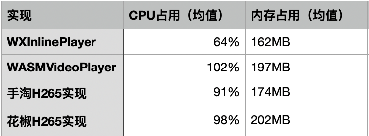

## WXInlinePlayer：高性能WASM播放器实现

### 缘起
随着直播和短视频的兴起，视频由于承担了更大的信息量，因此现在已经是非常主流的运营/产品信息输出方式，其中包括短视频、直播等。但目前我们所能看到的相关产品的具体实现形式主要都是Native的方式，Web相关的类似形式不管在性能抑或体验上都有非常大的差距。其中最重要的原因是国内各个浏览器厂商自身的利益关系所在，他们对HTML5的Video能力做了非常多的限制，不限于：
* 禁止自动播放；
* 播放器魔改为原生播放器，不可进行HTML相关元素层叠；
* 播放前后硬插广告内容；
* 视频自动置顶；
* 相关API和事件与标准实现不统一；
* ......

相关的问题在许多文章中都有对应的描述和涉及，也给出了非常多hack的方式试图绕过相关的限制已达到产品目的。但由于主动权完全掌握在浏览器平台方手上，因此这些hack手段失效非常快，极度的不可靠。

其中比较有代表性的是腾讯IMWeb团队写的[《复杂帧动画之移动端Video采坑实现》]()。我们可以看到对于复杂的帧动画而言，传统的动画技术方案例如：Lottie、Vivus等，由于技术上的原因是无法完全复原复杂帧动画效果的，唯独视频这一方式，不管在文件体积、渲染性能以及设计自由度上都有无可比拟的优势。但视频方案在HTML5上却遭受了如上所述的非常多的阻力。

为了解决这一系列的问题，依靠在WASM和音视频上的浅薄积累，我编写了[WXInlinePlayer](https://github.com/qiaozi-tech/WXInlinePlayer)来解决相关的问题，目前有非常多的安防监控、直播及短视频公司使用[WXInlinePlayer](https://github.com/qiaozi-tech/WXInlinePlayer)完成了自己的业务开发以及解码内核的定制化，并取得了非常好的线上效果。目前WXInlinePlayer的使用场景包括：
* 沉浸式短视频产品（Web版类抖音产品）
* H5复杂视频动画播放
* 无插件化安防监控

<div align=center>
    
    <p style="font-size:12px;color:gray;">使用WXInlinePlayer实现类抖音产品</p>
</div>

### 方案比较

在WXInlinePlayer诞生之前，实际上也有非常多的个人及公司做了相关类似实践，包括不限于：
* [基于WASM的H265播放器及在NOW直播中的应用](https://developer.aliyun.com/article/747663)
* [花椒前端基于WASM的H265播放器研发](https://cloud.tencent.com/developer/article/1467813)
* [手淘Web端H265播放器研发解密](https://fed.taobao.org/blog/2019/03/19/web-player-h265/)
* [基于WASM的开源H265播放器 - WasmVideoPlayer](https://github.com/sonysuqin/WasmVideoPlayer)
* ......

对于这些实践而言我们可以看到其具有两个共性：
1. 基本上都是基于FFmpeg的裁剪及编译实现
2. 主要是为了解决浏览器的H265播放问题

但在实际的使用中，以FFmpeg的裁剪及编译实现实际上是有其自身的局限性及问题的。对于Web这种非常资源大小敏感的环境，使用FFmpeg的裁剪及编译获得的相关WASM以及包装文件大部分都有超过1M以上的大小，即使使用GZIP等压缩手段也会超过500K以上。其次这种方案非常难以被优化，由于最新的FFmpeg包含非常多的部件，修改及优化的成本非常之高，例如想增加多WebWorker解码的能力来提升解码的性能，对于FFmpeg方案来说修改成本非常之大。

因此，在编写WXInlinePlayer之初，我就选择了另一条更轻量化更易扩展的道路：编解码库插件化。

<div align=center>
    
    <p style="font-size:12px;color:gray;">独立解码依赖</p>
</div>

通过这种方式，WXInlinePlayer可以根据使用情况选择合适的解码插件，同时针对各个解码插件进行针对性的体积优化和性能提升，例如我们使用H265相关实现来作比较：

<div align=center>
    
    <p style="font-size:12px;color:gray;">文件体积为WASM与相关JS文件总和</p>
</div>

可以看到，分离后的WXInlinePlayer解码器在压缩后相比其他实现有接近5倍的文件体积的减小。同时，WXInlinePlayer也依靠更轻量的解码和渲染架构，在H265的播放整体性能与内存占用上相比其余实现也有30%以上的提升：

<div align=center>
    
    <p style="font-size:12px;color:gray;">性能测试</p>
</div>

在使用花椒直播线上同一H265的FLV格式流的测试中，WXInlinePlayer在性能上相较于其他FFmpeg的实现都有比较显著的CPU和内存占用的提升。

### 整体逻辑

实际上现在基于WASM的播放器在架构实现上基本上都趋同，主要分为几层：
* I/O层：通过XHR或者WebSocket进行音视频数据的获取；
* 解码层：解码获取YUV图像数据及PCM音频数据
* 音画同步及缓冲区层：通过音视频时间戳进行对齐及缓冲部分播放数据
* 绘制层：通过Canvas或WebGL进行绘制
* 音频播放层：通过AudioContext进行音频播放

其逻辑用图表示如下：
<div align=center>
    
    <p style="font-size:12px;color:gray;">整体逻辑图</p>
</div>

在实际的编写过程中，为了更高的性能，我们一般会将I/O层和解码层放置在不同的WebWorker之中以此来提高性能。其音画同步和缓冲区层，对于WXInlinePlayer而言是放置在了一个名为Processor的对象中统一进行了处理。而绘制层为了进一步提升性能，使用WebGL进行了YUV420到RGB的转换以及绘制工作。

整体的逻辑从上面的描述来看并不是非常复杂，但是由于Web的一些功能缺失，要完整实现一套可用的WASM播放器还是存在一些挑战：

#### 兼容性问题

WASM的兼容性在目前而言已经有了比较大的改观，但是在移动端而言，由于国内各个浏览器厂家的实现并不统一，因此需要考虑WASM不可用的情况。在WXInlinePlayer中，为了更好的应对兼容性相关的问题，解码库编译出了ASM.JS及WASM两个版本，同时提供了降级的判断，方便使用中进行对应的处理：
```javascript
if (WXInlinePlayer.isSupport()) {
    WXInlinePlayer.init({
        asmUrl: './prod.all.asm.combine.js',
        wasmUrl: './prod.all.wasm.combine.js'
    });

    WXInlinePlayer.ready().then(() => {
        const player = new WXInlinePlayer({
            url: '......',
            $container: document.getElementById('container'),
            hasVideo: true,
            hasAudio: true,
            volume: 1.0,
            muted: false,
            autoplay: true,
            loop: true,
            isLive: false,
            chunkSize: 128 * 1024,
            preloadTime: 5e2,
            bufferingTime: 1e3,
            cacheSegmentCount: 64,
            customLoader: null
        });
    });
}
```

目前WXInlinePlayer兼容性已经覆盖主流浏览器：
* Android 5+
* iOS 10+ （含Safari及WebView）
* Chrome 25+
* Firefox 57+
* Edge 15+
* Safari 10.1+

#### 解码性能不足及卡顿

尽管WASM相比于JavaScript在性能上有非常大的提升，但是由于目前WASM的优化手段比较有限，像SIMD、多线程等支持都还存在问题，因此在播放部分高清视频的时候难免会造成解码性能不足卡顿的情况（对于移动端而言更明显）。在生产环境中，WXInlinePlayer的卡顿和延迟主要来自于3个地方：
* 网络加载的延迟
* 软解码的延迟
* 渲染的延迟

一般来说，如果在用户网络环境较好的情况下，渲染由于使用了WebGL，很难造成瓶颈（操作很单一），其中一般会因为软解码性能不足造成不停卡顿及延迟。

优化因为软解码性能不足造成的延迟，我们一般从几个地方着手：
* 视频的profile：相比于main/high而言，baseline不包含B帧，解码消耗更低；
* 视频帧率：过高的帧率会造成软解码跟不上，可以试着降低帧率，例如24fps；
* 视频码率：码率越高，视频富含的细节越多，也越清晰，但是会消耗更多的解码性能，可以试着降低码率；
* 视频分辨率：过高的视频会造成单帧传递的数量极大；

目前WXInlinePlayer在中高端机上解1280x720，码率1024，帧率24fps的视频比较流畅。除此之外，WXInlinePlayer也提供了performance事件帮助使用者了解当前的解码性能，便于提示用户降级到后备方案：
```javascript
player.on('performance', ({cost, average})=>{
  const prop = cost / average;
  if(prop >= 2.0){
    console.log('good performance');
  }else if(prop < 2.0 && prop >= 1.0){
    console.log('ok, thats fine');
  }else{
    console.log('bad performance');
  }
});
```

#### 自动播放

由于目前现代浏览器已经遵循[Autoplay Policy Changes](https://developers.google.com/web/updates/2017/09/autoplay-policy-changes)，因此在非用户主动触发播放或者MEI得分及权重较低的情况下是无法自动播放的。但WXInlinePlayer仍然对微信WebView以及无音频文件播放的场景下提供了自动播放的能力。

#### 直播支持

直播由于良好的互动性，因此被非常多的产品集成及使用，对于一个播放器而言，直播能力的支持也是必不可少的。在音频播放这块我们一般使用AudioContext，但可惜的是，目前而言AudioContext还无法很好的支持LiveStream的音频解码能力，因此WXInlinePlayer使用了[Multi Source Nodes](https://github.com/qiaozi-tech/WXInlinePlayer/blob/master/src/sound/browser.js#L219)的方式来进行了音频LiveStream的支持，当然，这块也可以进一步优化，预计后期将会提升为AudioWorklet的方式来进行相关支持。

### 更多

未来随着5G及更高性能的硬件设备的发展WASM会逐渐渗透在多个领域。浏览器依托WASM技术必将会为未来扩展音视频处理的通用能力提供了想象的空间。目前WXInlinePlayer已经更新到了1.3.3版本，随着越来越多公司的使用，WXInlinePlayer在现版本已经逐步稳定。在后期中，我们将进一步尝试增强WXInlinePlayer的性能和易用性，包括不限于：
* 重构解码器，精确缓存帧数据；
* 增加OffscreenCanvas的支持，提升性能和减少内存占用（Chrome 69+）；
* 提供默认的播放器UI；
* 新增H264/H265的SIMD支持；
* 支持多Worker的GOP并行解码，提升软解性能；
* 进一步降低直播延迟；
* ......

后续还有很多继续优化和深入的点，对相关知识感兴趣的同学欢迎沟通交流。
